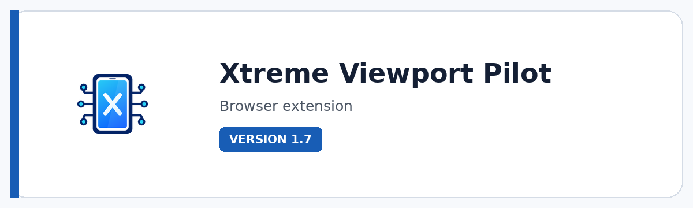

# Xtreme Viewport Pilot

**Test responsive experiences across devices, viewports, networks, CPU conditions, locations, and synchronized multi-device sessions from one browser workspace.**

  

  

---

## Overview

Xtreme Viewport Pilot is a responsive-testing cockpit for developers, designers, QA teams, product owners, and anyone responsible for how a web experience behaves across devices and conditions. Instead of resizing a browser window repeatedly, it provides curated device profiles, reusable custom profiles, network/CPU/location conditions, popup device windows, and LAB sessions with multiple synchronized viewports.

The LAB workflow is the differentiator: open two to four device windows and synchronize selected interactions such as scrolling, navigation, safe clicks, and non-sensitive form values. It is built to make comparison faster, regressions easier to spot, and responsive behavior easier to discuss with a team.

## Get the current build

This product is shared directly with supporters instead of through a public download link. [Support development on Ko-fi](https://ko-fi.com/pacosalasv) and include **the product name and the email address where you want to receive it** in your message. I will send the current available build directly.

Direct distribution keeps access personal, connects product feedback with active users, and gives supporters a simple route to the current build without hunting through mirrors or outdated packages.

## Key features

- **Curated device, viewport, browser, and system profiles** with search and filtering for fast setup.
- **LAB multi-device sessions** with two to four synchronized viewport windows for side-by-side responsive validation.
- **Synchronized interactions** for scroll, navigation, safe clicks, and non-sensitive form values across LAB devices.
- **Network and CPU conditions** including Slow 3G, Fast 3G, 4G/LTE, Offline, mid-tier CPU, and low-end CPU profiles.
- **Geolocation override** with built-in cities and custom coordinates for location-aware testing.
- **Reusable custom profiles** covering dimensions, DPR, platform, User-Agent, color scheme, pointer, hover, motion, touch and related browser signals.
- **Import/export of custom profiles** for backup and repeatable test setups.
- **31-language interface coverage** across settings, dialogs, dynamic status messages, accessibility text, and floating controls.

## Standout tools and workflows

| Tool / workflow | Why it matters |
|---|---|
| **Device Library** | Choose curated device/viewport/browser profiles instead of rebuilding common test sizes manually. |
| **LAB** | Launch two to four synchronized device windows and compare responsive behavior in parallel. |
| **Network & CPU** | Apply throttling/CPU conditions to evaluate experiences beyond ideal desktop performance. |
| **Location** | Test location-aware behavior using built-in cities or exact custom coordinates. |
| **Custom Profiles** | Create reusable combinations of viewport, DPR, platform, User-Agent, touch, pointer and media-query signals. |
| **Open Window / Adapt Tab** | Test in a dedicated device window or adapt the current tab depending on the workflow. |
| **Rotate + Floating Controls** | Switch orientation and use compact in-page controls while testing. |
| **Import / Export** | Move custom profile collections between setups as JSON. |

## Product status

| Item | Details |
|---|---|
| Status | **Current release** |
| Version | 1.7 |
| Product type | Browser extension |
| Browsers | Chromium / Edge / Firefox |
| Best for | Responsive QA, web development, design review, product testing, demos |

## Media

Additional screenshots and workflow previews are coming soon.

## Documentation and support

| Resource | Link |
|---|---|
| Current build | [Request supporter access](https://ko-fi.com/pacosalasv) |
| Support guide | [SUPPORT.md](SUPPORT.md) |
| Repository changelog | [CHANGELOG.md](CHANGELOG.md) |
| Issues | [Open or review issues](https://github.com/pacosalasv/Xtreme_Viewport_Pilot-Support/issues) |
| Discussions | [Ask questions and share feedback](https://github.com/pacosalasv/Xtreme_Viewport_Pilot-Support/discussions) |

## Support development

If this tool saves you time, Ko-fi support helps fund maintenance, compatibility work, documentation, testing, and continued development.

  

## Ecosystem

| Destination | Link |
|---|---|
| Supporter access | [Request the current build on Ko-fi](https://ko-fi.com/pacosalasv) |
| Issues & feedback | [GitHub Issues](https://github.com/pacosalasv/Xtreme_Viewport_Pilot-Support/issues) |
| Xtreme Mindset | [Product lab](https://xtrememindset.blogspot.com/) |
| Paco Salas \| DRH | [Official site](https://pacosalasv.blogspot.com/) |
| DRH Blender tools | [BlendKit catalog](https://www.blendkit.com/?query=author_id:205846) |
| Sketchfab / Código Píxel | [3D model collections](https://sketchfab.com/codigopixel/collections) |
| KreaOn | [Technology education](https://www.kreaon.com/) |
| PiNu | [Connected physical products](https://pinu.com.mx/) |
| GitHub | [pacosalasv](https://github.com/pacosalasv) |

## License

Licensing and usage terms are provided with the current Xtreme Viewport Pilot distribution.
